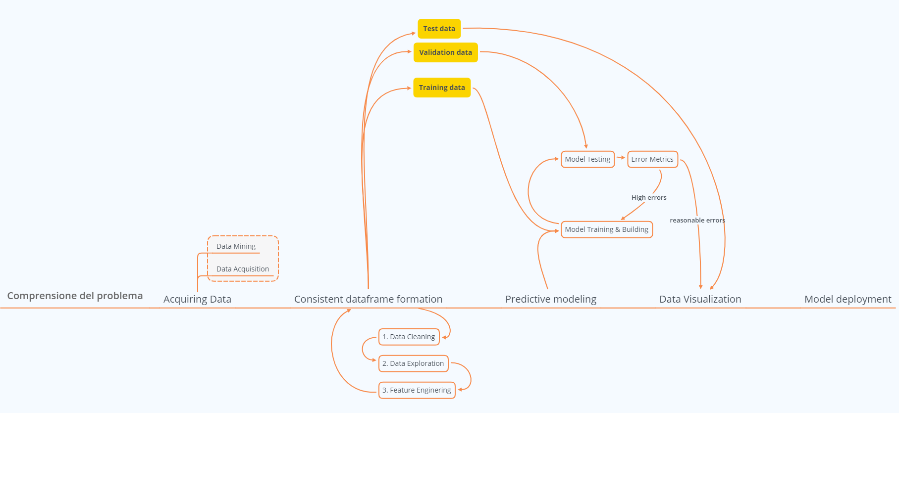
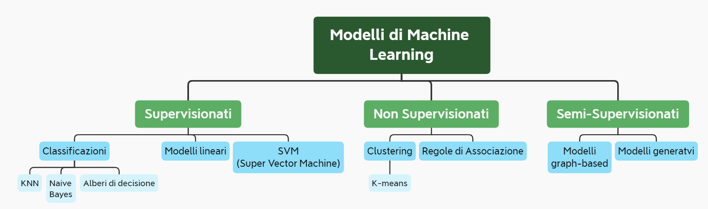
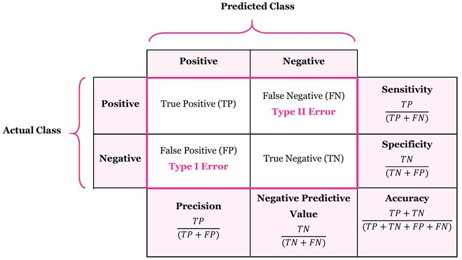

# Ciclo di vita di un algoritmo nel Datascience

[Fase 1 - Comprensione del problema](##Comprensione del problema)

[Fase 2 - Acquiring data](#Raccolta dei dati (Data mining))

[Fase 3 - Data cleaning](#Analisi di un dataframe (Data cleaning))

[Fase 4 - Data exploration](#Esplorazione dei dati (Data exploration))

[Fase 5 - Feature engineering](#Manipolazione del dataframe (Feature engineering))

[Fase 6 - Predictive modeling](#Realizzazione del modello predittivo)

[Fase 7 - Data Visualization](#Analisi dei risultati (Data visualization))

## Comprensione del problema

​																																					[Torna su](#Ciclo di vita di un algoritmo nel Datascience)

## Raccolta dei dati (Data mining)

​																																					[Torna su](#Ciclo di vita di un algoritmo nel Datascience)

## Analisi di un dataframe (Data cleaning)

Prima di implementare grafici, addestrare modelli o fare predizioni, c'è il dataframe. Questo ammasso, a volte immenso, di dati che ci capita tra le mani di cui necessita di alcune attenzioni prima di essere utilizzato. Così come il falegname deve osservare il legname con cui costruire un mobile prima di iniziare a tagliarlo, nella stessa maniera devono essere trattati i dati. Di seguito alcuni appunti sulle funzioni che utilizzo e sulle pratiche che adotto prima di iniziare a lavorare sui dati.

### Funzioni

* <u>df.info()</u>
* <u>df.describe()</u>
* df.dtypes
* df.count()
* df.shape

Le funzioni <u>info</u> e <u>describe</u> sono quelle che molto probabilmente racchiudono 

Trovare il numero di valori mancanti (Nan) è il primo passo per capire se una feature possa essere o meno utilizzata. Nell'esempio del Titanic sotto la voce 'deck' sono presenti solo 200 valori su 891, questo mi porta ad escluderla all'atto dell'analisi.

​																																					[Torna su](#Ciclo di vita di un algoritmo nel Datascience)

## Esplorazione dei dati (Data exploration)

​																																					[Torna su](#Ciclo di vita di un algoritmo nel Datascience)

## Manipolazione del dataframe (Feature engineering)

​																																					[Torna su](#Ciclo di vita di un algoritmo nel Datascience)

## Realizzazione del modello predittivo

Dalla fase precedente abbiamo estrapolato tre dataset:

* Training data
* Validation data
* Test data

Questi tre dataset saranno utilizzate per le tre fasi successive:

1.  Model training & building: la fase di addestramento, in cui il modello viene addestrato tramite i training data

2. Model testing: in cui traimite i validation data si recuperano i risultati ottenuti dal proprio modello

3. Error metrics: fase in cui si analizzano attraverso funzioni per modelli di classificazione o di regressione la bontà dei risultati ottenuti attraverso il model testing. A questo punto se i risultati non sono soddisfacenti si rinizia dal punto 1, cambiando alcuni parametri del modello, o cambiando proprio modello. Al contrario sei i risultati ottenuti sono buoni di procederà alla fase successiva: la rappresentazione dei dati ottenuti.

### Fase di addestramento

In base al tipo di dati che si hanno a disposizione e al tipo di risposta che si vuole ottenere viene definito il tipo di algoritmo o di famiglia di algoritmi che si possono utilizzare.

### Test del modello

Con i modelli di tipo supervisionato verrà addestrato il modello con i training data e testato il modello con il validation data (o con il test data a seconda di quanto scelto nei punti precendenti).

Ciò che il modello predirrà con X_test data verrà confrontato con quanto compare nell' y_test data, tramite gli algoritmi opportuni a seconda si tratti di un modello di classificazione o di regressione. Per la fase successiva passeremo due set di dati:

* **y_test** data
* **predict** data

### Error metrics validation

Possiamo identificare funzioni che calcolano gli errori principalmente per modelli di classificazione e per modelli di regressione.

#### Classification Error Metrics

Solitamente ogni classificazione che il tuo modello può predire può essere di due tipi: corretta o incorretta, senza altra misura intermedia di errore, a prescidere che sia una classificazione binaria o multiclasse, il principio vale comunque.

É importante capire, che per quanto una risposta possa essere o giusta o sbagliata, non tutti gli errori hanno lo stesso peso. In statistica possono essere identificati due tipi di errore:

+ errori di primo tipo: conosciuti come falsi positivi

+ errori di secondi tipo: conosciuti come falsi negativi

Molte teorie statistiche si basano sulla riduzione di uno o di entrambi di questi errori.

Per comprendere questo punto verranno introdotti i concetti dietro le metriche di classificazione dell'errore che possiamo ritrovare confrontate nella **Matrice di Confusione**:

* **Accuracy**: semplicemente misura la percentuale di predizioni corrette in rapporto al numero totale delle previsioni. 
  $$
  \frac {Σ True Pos + Σ True Neg}{
  Σ Total Cases}
  $$
  É il dato più "grezzo" che valuta la bontà di un modello in maniera diretta, per essere più precisi si possono trovare due definizioni di accuratezza: 

  - più comunemente, è una descrizione di errori sistematici , una misura della distorsione statistica ; la bassa precisione provoca una differenza tra un risultato e un valore "vero". ISO chiama questa verità .
  - In alternativa, ISO definisce l' accuratezza come la descrizione di una combinazione di entrambi i tipi di errore (casuale e sistematico), quindi un'elevata accuratezza richiede sia un'alta precisione che un'elevata verità.

  Questo valore è molto <u>utile quando abbiamo un dataset ben bilanciato</u>, in cui gli elementi sono presenti in maniera omogenea, mentre perde via via di valore quando al contrario abbiamo classi molto sbilanciate, in quanto l'errore non sarebbe proporzionale al numero di elementi, in questi casi assumono maggiore valenza i concetti di <u>recall</u> e <u>precision</u>;

* **Recall** (o Sensitivity): indica l'abilità di un modello di trovare TUTTI i casi rilevanti all'interno di un dataset, si calcola con:
  $$
  \frac{ΣTrue Pos} {ΣTrue Pos + ΣFalse Neg}
  $$
  la Recall è una misura di completezza o quantità (una misura del 100% indica che non ci sono falsi negativi).

* **Precision**:  (chiamata anche positive predictive value) è l'abilità di un modello di identificare SOLO i dati rilevanti. la precisione può essere vista come una misura che indica l'esattezza o la qualità di un modello predittivo, indicando l'assenza di falsi positivi.
  $$
  \frac{ΣTrue Pos} {ΣTrue Pos + ΣFalse Pos}
  $$
  
Spesso c'è un divario tra i risultati di Recall e Precision, questo perchè mentre il recall esprime l'abilità di trovare TUTTI i casi rilevanti in un dataset, la precisione esprime la proporzione tra i dati che il nostro modello afferma siano rilevanti che in realtà lo erano.
  
* **F1-score**:  Il valore F1-score risulta essere una combinazione tra questi due, infatti risulta essere la media armonica tra questi due, racchiudendo i precedenti valori in un'unica formula:
  $$
  F_1-score = 2 *(\frac{precision * recall}{precision+recall})
  $$
  Viene utilizzata una media armonica al posto di una media semplice per dare meno peso ai valori estremi. Un classificatore con precisione di 1 e recall di 0 avrebbe come media semplice 0.5 ma un valore di F1-score di 0.

Il risultato di questi valori o più in generale la matrice di confusione e tutti i parametri calcolabili, sono UNICAMENTE dei modi di confrontare i valori predetti con quelli reali. É importante comprendere che <u>quello che costituisce una buona metrica di valutazione dipende dalle situazioni specifiche del problema che si affronta</u>.

Ad esempio è fondamentale capire in che contesto ci si trova: se i valori in un data set sono bilanciati o meno, oppure se è più importante trovare i valori positivi, quindi si può chiudere un'occhio sui falsi positivi, o se viceversa non sono accettabili quindi si cerca di favorire modelli che forniscano un numero più basso di falsi positivi anche a discapito di un aumento di falsi negativi. Ovviamente queste decisioni iniziano ad essere prese durante il primo punto di questo percorso, [la comprensione del problema](#Comprensione del problema) e continuano a essere aggiornati constantemente con gli addetti ai lavori per cui si costruisce il modello.

#### Regression Error Metrics

I modelli che affrontano l'analisi della regressione cercano di predirre valori continui, per valutare i risultati ottenuti non possono essere utilizzate le metriche designate per i problemi di classificazione come l'accuratezza o il recall, visti precendetemente. Alcune delle più comuni metriche che valutano un modello di regressione sono:

* Mean Absolute Error
* Mean Squared Error
* Root Mean Squared Error

Analizzandoli in dettaglio:

- Mean Absolute Error (o media degli errori assoluti): è semplicemente la media dei valori assoluti della differenza tra valore calcolato e valore reale. La formula è:
  $$
  \frac{1}{n} \sum_{i=1}^{n}\arrowvert y_i - \widehat{y}_i \arrowvert \\
  
  y = real\ value\\
  \widehat{y}=predicted\ value
  $$
  questa misura non attua particolari strategie per gestire il peso di valori estremi occasionali.

* Mean Square Error (o errore quadratico medio) che viene calcolato come la media del quadrasto degli errori con la formula. 
  $$
  \frac{1}{n} \sum_{i=1}^{n} (y_i-\widehat{y}_i)^2
  $$
  Questo permette di dar maggior rilievo a errori di maggior entità rispetto al MAE, rendendo l'MSE più popolare.

​																																					[Torna su](#Ciclo di vita di un algoritmo nel Datascience)

## Analisi dei risultati (Data visualization)

​																																					[Torna su](#Ciclo di vita di un algoritmo nel Datascience)