# Seaborn

Seaborn è una libreria per il plotting statistico, basata su matplotlib, rimanendo più "user friendly". Ha stili di default predefiniti molto belli ed è strutturata per lavorare molto bene con i dataframe di pandas.

[TOC]


## Distribution plots

Indicano come una variabile è distribuita, mostrando la probabilità di trovare una variabile entro un determinato range. Questi grafici dovrebbero essere normalizzati per dare risultati migliori

### Distplot

### Rugplot

### KDE


​																																					[Torna su](#Seaborn)

## Relational Plots

Indicano la relazione tra due o più variabili, queste relazioni aiutano a capire meglio i dati e nel caso a sintetizzare una nuova variabile da quelle esistenti

### Jointplot

### Pairplot

​																																					[Torna su](#Seaborn)

## Categorical plots

Le variabili categoriche (o qualitative) sono variabile che catalogano all'interno di una determinata categoria un elemento di una popolazione. Possiamo avere variabili oridinali o nominali:

* **ordinali** (o ordinabile) quando possono essere ordinate in modo crescente o decrescente
* **nominali** (o sconnesse) quando sono tutte allo stesso livello

### Countplot

Conta gli elementi che possiedono una determinata variabile categorica. La lista delle palette la si può trovare su https://matplotlib.org/3.1.1/gallery/color/colormap_reference.html.

```python
sns.set_style('whitegrid')
plt.figure(figsize=(3,6))
sns.set_context('poster', font_scale=1)
cola = [ 'cyan', 'pink']
a = sns.countplot(x='sex', data=df, palette=cola)
a.set(xlabel='righe', ylabel='colonne')
sns.despine(left=True, bottom=True)
```

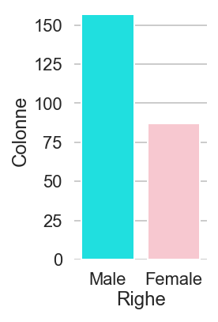

### Barplot

Il più semplice dei plot che rappresentano dati categorici. Le variabili categoriche vengono raggruppate secondo la funzione passata al parametro estimator, se non viene passato nessun parametro di default è settata sulla media (np.mean)


```python
plt.figure(figsize=(10,5))
plt.subplot(131)
plt.title('Somma')
sns.barplot(x=df.sex, y=df.tip, data=df[df.smoker=='Yes'], estimator=np.sum)
plt.subplot(132)
plt.title('Media')
sns.barplot(x=df.sex, y=df.tip, data=df[df.smoker=='Yes'], estimator=np.mean)
plt.subplot(133)
plt.title('Deviazione Standard')
sns.barplot(x=df.sex, y=df.tip, data=df[df.smoker=='Yes'], estimator=np.std)
```

​																																					[Torna su](#Seaborn)

### Boxplot

Per comprendere il Boxplot è necessario fare una premessa riguardante il concetto di quartile e il concetto di mediana.

> In statistica, in particolare in statistica descrittiva, data una distribuzione di un carattere quantitativo oppure qualitativo ordinabile (ovvero le cui modalità possano essere ordinate in base a qualche criterio), i <u>**quartili** sono quei valori/modalità che ripartiscono la popolazione in quattro parti di uguale numerosità</u>.
>
> I quartili sono indici di posizione e rientrano nell'insieme delle statistiche d'ordine.
>
> <u>La differenza tra il terzo ed il primo quartile è un indice di dispersione ed è detto **scarto interquartile**.</u>
>
> Il quartile zero, il primo, il secondo, il terzo e il quarto quartile corrispondono con le prime modalità la cui frequenza cumulata percentuale è almeno 0, 25, 50, 75 e 100 rispettivamente.  I quartili equivalgono ai quantili q0 (quartile zero), q1/4 (primo quartile), q2/4=q1/2 (secondo quartile), q3/4 (terzo quartile) e q1 (quarto quartile).
>
> ​																														da Wikipedia  [Quartile](https://it.wikipedia.org/wiki/Quartile) 

- **secondo quartile (q2/4)** = coincide con la mediana e divide la popolazione in due  parti di uguale numerosità.

- **primo e il terzo quartile (q1/4 e q3/4)** = coincidono con la mediana delle due parti delineante dal secondo quartile

- **quartile  zero (q0)** = coincide con il valore minimo della distribuzione
- **quarto quartile (q1)** = coincide con il valore massimo della distribuzione

I quartili vengono inoltre utilizzati per rappresentare un Box-plot.

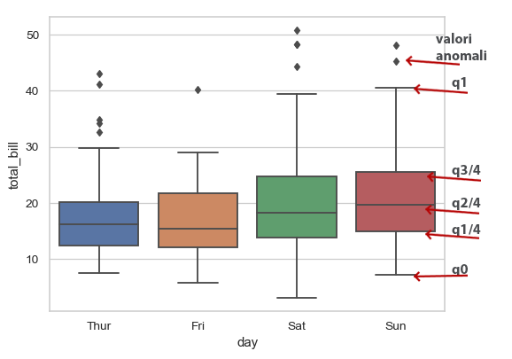

Simili al boxplot ci sono

>See also
>
>Violinplot
>A combination of boxplot and kernel density estimation.
>
>Stripplot
>A scatterplot where one variable is categorical. Can be used in conjunction with other plots to show each observation.
>
>Swarmplot
>A categorical scatterplot where the points do not overlap. Can be used with other plots to show each observation.
>
>Catplot
>Combine a categorical plot with a FacetGrid.
>
>​																			dalla documentazione di [Boxplot su Searborn](https://seaborn.pydata.org/generated/seaborn.boxplot.html)

Di seguito una rapida panoramica dei grafici elencati in precendenza:

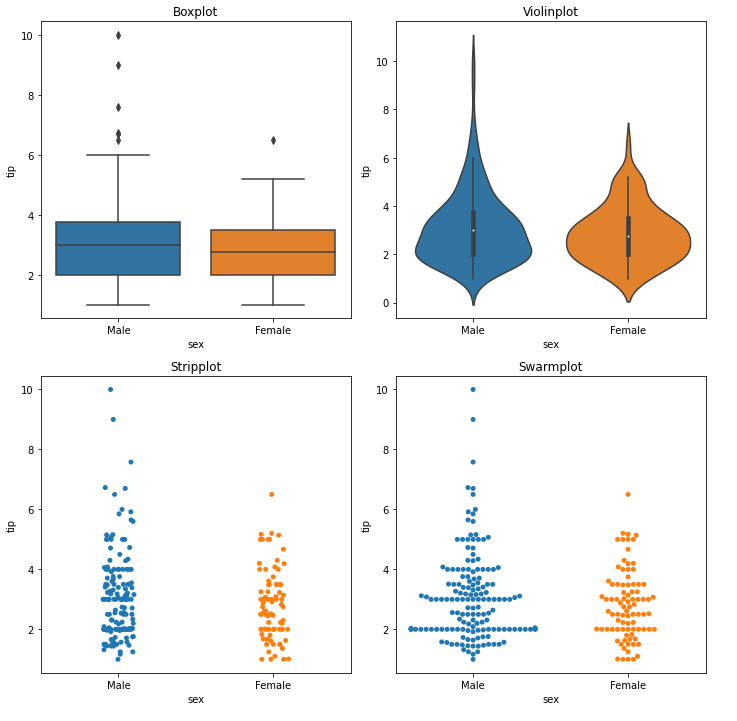

Questo è invece il codice compatto per la visualizzazione del precedente grafico

```python
plt.figure(figsize=(10,10))
i=1
titles=['Boxplot', 'Violinplot', 'Stripplot', 'Swarmplot']
grafici=(sns.boxplot, sns.violinplot, sns.stripplot,sns.swarmplot)

for fun, title in zip (grafici, titles):
    plt.subplot(2,2,i)
    plt.title(title)
    fun(x='sex',y='tip', data=df)
    plt.tight_layout()
    i+=1
```

Qui si può notare come i titoli sono stati inseriti all'interno di un ciclo for, stessa cosa vale per le funzioni, questo esprime per me la potenza e la versatilità di Python per semplificare il codice e renderlo molto elegante e leggibile.

​																																					[Torna su](#Seaborn)

### Violinplot

Il violinplot ha alcune caratteristiche che lo distinguono dal boxplot, una molto utile è la possibilità di splittare la seconda vabile categorica all'interno della figura.

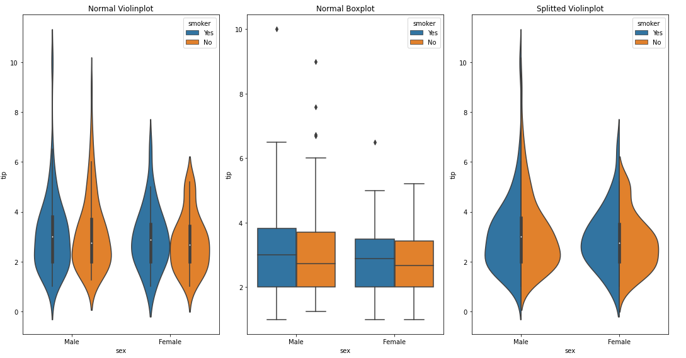

Questo permette di analizzare meglio la distribuzione delle DUE categorie, usate con il parametro hue.

Il violinplot può essere più indicato a chi ha una maggiore capacità di lettura e interpretazione dei grafici, mentre il boxplot è sicuramente di più semplice analisi anche per i non addetti ai lavori.

Di seguito il codice del grafico precedente:

```python
plt.figure(figsize=(15,8))
plt.subplot(131)
plt.title('Normal Violinplot')
sns.violinplot(x='sex', y='tip', data=df, hue='smoker')
plt.tight_layout()
plt.subplot(132)
plt.title('Normal Boxplot')
plt.tight_layout()
sns.boxplot(x='sex', y='tip', data=df, hue='smoker')
plt.subplot(133)
plt.title('Splitted Violinplot')
sns.violinplot(x='sex', y='tip', data=df, hue='smoker', split = True)
plt.tight_layout()
plt.show()
```

​																																					[Torna su](#Seaborn)

### Stripplot

Tramite l'attributo jitter permette di visualizzare uno scatterplot in cui una variabile è categorica in maniera più chiara. Infatti è possibile disperdere leggermente i valori per non averli troppo sovrapposti e vedere meglio la densità.


```
plt.figure(figsize=(10,8))
plt.subplot(131)
plt.title('Stripplot')
sns.stripplot(x='sex', y='tip', data=df, jitter=0.4)
plt.tight_layout()
plt.subplot(132)
plt.title('Scatterplot')
plt.tight_layout()
sns.scatterplot(x='sex', y='tip', data=df)
plt.show()
```

É possibile usare gli attributi hue='nome_colonna_categorica' e split=True per differenziare maggiormente i valori.

​																																					[Torna su](#Seaborn)

### Swarmplot

Evita ogni sovrapposizione dei punti rendendo ancora più chiara la distribuzione anche rispetto allo Stripplot, risultando una via di mezzo tra lo Stripplot e il Violinplot.

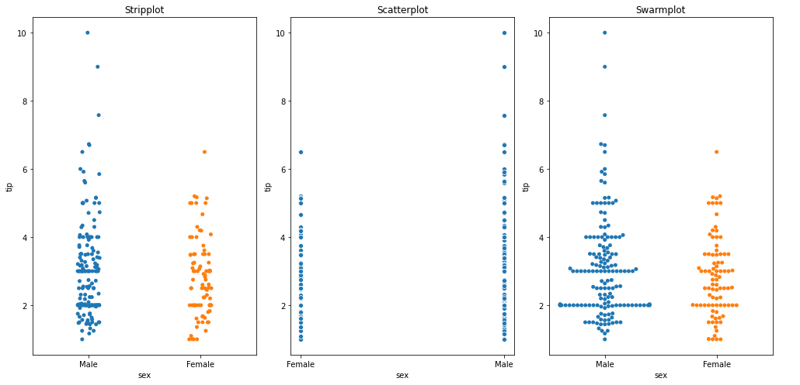

Per dataset molto larghi o comuque per livelli molto popolati è comunque sconsigliabile usare questo tipo di grafico.  É possibile combinarlo con il KDE del Violinplot con il seguente codice:

```python
sns.violinplot(x='sex', y='tip', data=df)
sns.swarmplot(x='sex', y='tip', data=df, color='k')
```

Il risultato è sicuramente utile per l'analisi dei dati e un po' meno per le presentazioni perché rischia di diventare poco leggibile.

​																																					[Torna su](#Seaborn)

### Catplot

Di seguito il grafico catplot che si distingue dai precedenti in quanto, essendo combinato con Facegrid non è facilmente implementabile con i subplot di matplolib

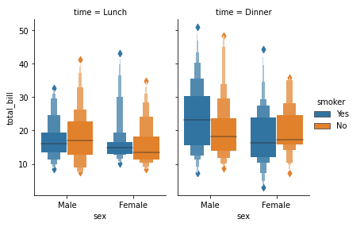

il codice del grafico:

```python
sns.catplot(x="sex", y="total_bill",
                hue="smoker", col="time",
                data=df, kind="boxen",
                height=4, aspect=.7);
```

Attraverso l'attributi kind è possibile richiamare gli altri grafici categorici visti come('violin', 'box', 'boxen', 'bar', 'swarm', 'strip', 'point')

​																																					[Torna su](#Seaborn)

## Matrix plot

Sono grafici in cui i dati delle righe e delle colonne sono rappresentati attraverso dei valori in base a una determinata scala di colore

Prima di affrontare i grafici in matrice è necessario introdurre due concetti statistici:

* la tabella di correlazione
* la tabella pivot

Una tabella o **matrice di correlazione** è una tabella che <u>mostra il coefficente di correlazione che esiste tra determinate variabili numeriche</u>. Ogni cella della tabella mostra la correlazione tra due varibili, per correlazione si intende quanto una variabile è legata ad un'altra ossia al variare di uno varia anche l'altra.

```python
dataframe.corr()
```

|            | total_bill | tip      | size     |
| :--------- | :--------- | :------- | :------- |
| total_bill | 1.000000   | 0.675734 | 0.598315 |
| tip        | 0.675734   | 1.000000 | 0.489299 |
| size       | 0.598315   | 0.489299 | 1.000000 |

Un **tabella pivot** è uno <u>strumento analitico e di reporting necessario alla creazione di tabelle riassuntive</u>, il suo fine principale è di organizzare dati complessi tramite una scelta opportuna di campi e degli elementi che devono comporla.

```python
f.pivot_table(index='month', columns='year', values='passengers')
```

| month\year | 1949 | 1950 | 1951 | 1952 | 1953 | 1954 | 1955 | 1959 | 1960 |
| ---------: | ---: | ---: | ---: | ---: | ---: | ---: | ---: | ---: | ---: |
|    January |  112 |  115 |  145 |  171 |  196 |  204 |  242 |  360 |  417 |
|   February |  118 |  126 |  150 |  180 |  196 |  188 |  233 |  342 |  391 |
|      March |  132 |  141 |  178 |  193 |  236 |  235 |  267 |  406 |  419 |
|      April |  129 |  135 |  163 |  181 |  235 |  227 |  269 |  396 |  461 |
|        May |  121 |  125 |  172 |  183 |  229 |  234 |  270 |  420 |  472 |
|       June |  135 |  149 |  178 |  218 |  243 |  264 |  315 |  472 |  535 |
|       July |  148 |  170 |  199 |  230 |  264 |  302 |  364 |  548 |  622 |
|     August |  148 |  170 |  199 |  242 |  272 |  293 |  347 |  559 |  606 |
|  September |  136 |  158 |  184 |  209 |  237 |  259 |  312 |  463 |  508 |
|    October |  119 |  133 |  162 |  191 |  211 |  229 |  274 |  407 |  461 |
|   November |  104 |  114 |  146 |  172 |  180 |  203 |  237 |  362 |  390 |
|   December |  118 |  140 |  166 |  194 |  201 |  229 |  278 |  405 |  432 |


### Heatmap

Mostra i dati nell'ordine in cui sono caricati o raggruppati.

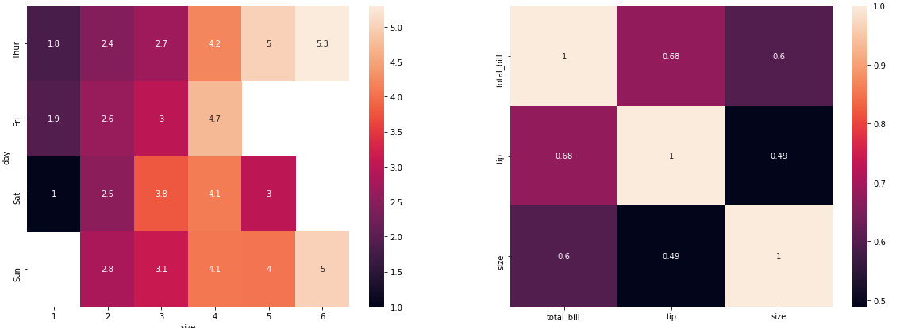

```python
tablecorr = df.corr() 
pivtable = df.pivot_table(index='day', columns='size', values='tip')

plt.figure(figsize=(20,7))

plt.subplot(121)
plt.title('Tabella Pivot')
sns.heatmap(pivtable,annot=True)

plt.subplot(122)
plt.title('Tabella di correlazione')
sns.heatmap(tablecorr, annot=True)

plt.show()
```

Altri parametri che possono essere aggiunti sono:

* **cmap**: impostare la colorazione (coolwarm, hot, magma.....)
* **linecolor**: colore delle linee
* **linewidths**: larghezza delle colonne

​																																					[Torna su](#Seaborn)

### Clustermap

I dati verranno raggruppati in famiglie più o meno similari tra essi.


```python
pivtable = f.pivot_table(index='month', columns='year', values='passengers')
sns.clustermap(pivtable, cmap='coolwarm', standard_scale=1)
plt.title('Clustermap Normalizzato')
sns.clustermap(pivtable, cmap='coolwarm')
plt.title('Clutermap NON normalizzato')
plt.show()
```

​																																					[Torna su](#Seaborn)

## Grid in Seaborn

+ **Pairplot**(dataframe) restituisce in automatico una griglia di grafici in cui vengono messe le variabili a due a due.

+ **PairGrid** fa la stessa cosa ma lascia maggiore libertà nella realizzazione dei singoli grafici:

  ```
  g = sns.PairGrid(iris)
  g.map_diag(sns.distplot)
  g.map_upper(sns.kdeplot)
  g.map_lower(sns.scatterplot)
  ```

  

  

+ **FacetGrid** permette di scegliere le feature su cui fare il grafico:

  ```
  df = sns.load_dataset('tips')
  g = sns.FacetGrid(data=df, col='time', row='smoker')
  g.map(sns.distplot,'total_bill')
  ```

  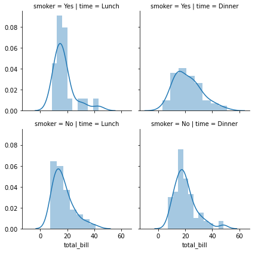

Nel caso si voglia mettere in relazione due variabili quantitavite

```python
df = sns.load_dataset('tips')
g = sns.FacetGrid(data=df, col='time', row='smoker')
g.map(sns.scatterplot,'total_bill', 'tip')
```

​																																					[Torna su](#Seaborn)

### Regression plot

Seaborn permette di visualizzare direttamente modelli di regressione lineare direttamente tramite grafico.

```python
df = sns.load_dataset('tips')
sns.lmplot(x="total_bill", y="tip" , data=df, height=12, markers=['s','v'], scatter_kws={'s':50})
```

* dove **height** ha sostituito l'attributo size per definire la grandezza del grafico

* **markers** serve per decidere i simboli che rappresentano le varie tipologie

* **scatter_kws** definisce la grandezza dei punti

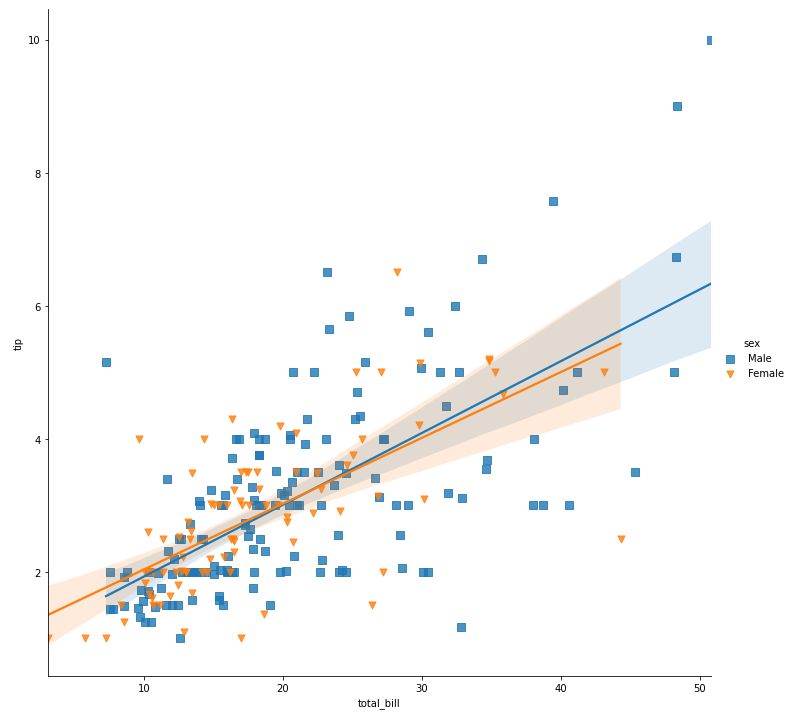

É possibile inoltre inserire variabili categoriche (qualitative) per avere una lettura migliore dei dati, si possono selezionare e confrontare sino a 3 variabili categoriche (qualitative) contemporaneamente.

```
sns.lmplot(x="total_bill", y="tip" , data=df, col='smoker', row='time', hue='sex', aspect=1.5, height=5, scatter_kws={'s':30})
```

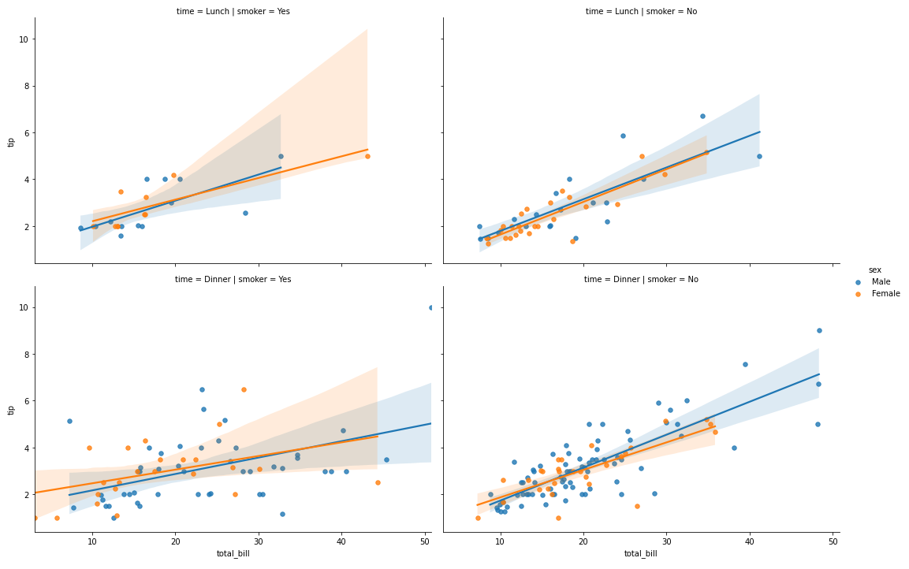

```python
sns.lmplot(x="total_bill", y="tip" , data=df, col='sex', row='time', hue='smoker', aspect=1.5, height=5, scatter_kws={'s':30})
```

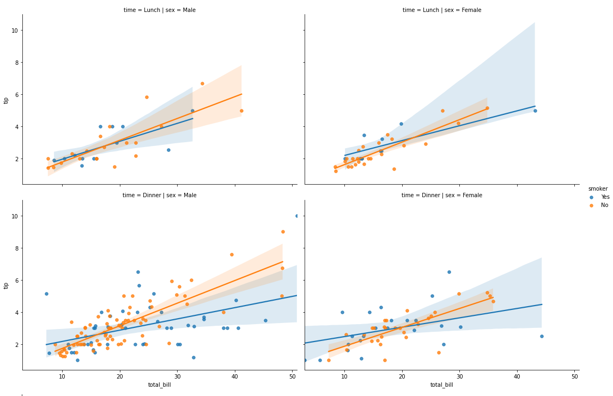

Da notare come sostituendo l'attributo col con l'attributo hue ci si ha una visione completamente diversa dei dati riuscendo a individuare caratteristiche chiave

